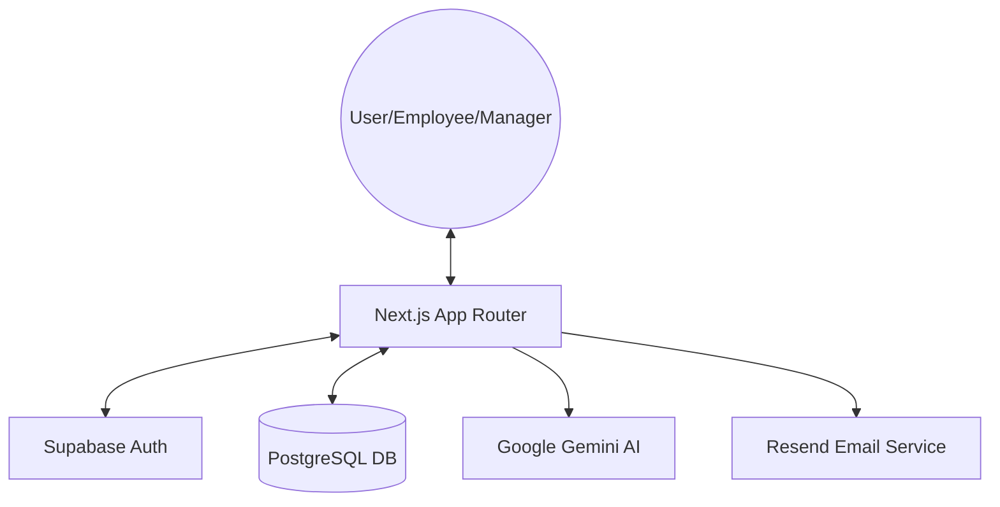

# Zevian: Architecture & Tech Stack

> **Superseded by [`technical_reference.md`](./technical_reference.md)**, which is verified against
> the current source and includes the data model, route/shell structure, and known gaps. The
> corrections below were applied 2026-07-07; keep this file for its high-level framing, but treat
> `technical_reference.md` as the source of truth for anything specific.

## Tech Stack

### Frontend
- **Framework**: Next.js 14 (App Router)
- **Language**: TypeScript
- **Styling**: Hand-rolled CSS-variable design system (`src/design-system/tokens.ts` +
  `src/styles/globals.css`) — **not Tailwind**. No `tailwind.config.*` exists at the repo root.
- **Icons**: Fully custom hand-drawn SVG set via `Icon` component — **not Lucide React**.
- **State Management**: React Hooks (Server Components & Client Components)
- **Fonts**: Plus Jakarta Sans (display/numeric), Outfit (body/UI), DM Mono (monospace/tabular)

### Backend & Infrastructure
- **BaaS**: Supabase
    - **Database**: PostgreSQL
    - **Authentication**: Supabase Auth (Email/Password, OAuth, Invitation flow)
    - **Security**: Row Level Security (RLS)
    - **Storage**: Supabase Storage (Project documents)
- **Deployment**: Netlify (`netlify.toml` + `@netlify/plugin-nextjs`) — dev branch → Netlify dev URL, main branch → app.zevian.co, per `CLAUDE.md`.
- **Email**: Resend (Transactional emails like invitations)

### AI Core
- **LLM**: Google Gemini (`@google/generative-ai`)
- **Features**: 
    - AI-powered report evaluation
    - Automated summaries and reasoning
    - Goal criteria analysis

---

## System Architecture

### High-Level Diagram

### Data Architecture
Zevian uses a multi-tenant architecture where organizations are the top-level entity. Access is strictly controlled via Supabase RLS policies.

- **Organizations**: Manage organization-level settings, branding, and billing.
- **Projects**: Group-related goals and team members.
- **Goals**: Specific, measurable targets assigned to employees.
- **Reports**: Periodic submissions by employees, evaluated by AI against goal criteria.
- **Criteria**: Breakdown of goal requirements used for scoring.

### Security Model
- **Authentication**: JWT-based session management managed by Supabase.
- **Authorization**: Granular RLS policies in PostgreSQL ensure:
    - Employees can only see their own reports and assigned projects/goals.
    - Managers can see reports, projects, and goals within their organization.
    - Admins can manage organization-wide settings and invites.
